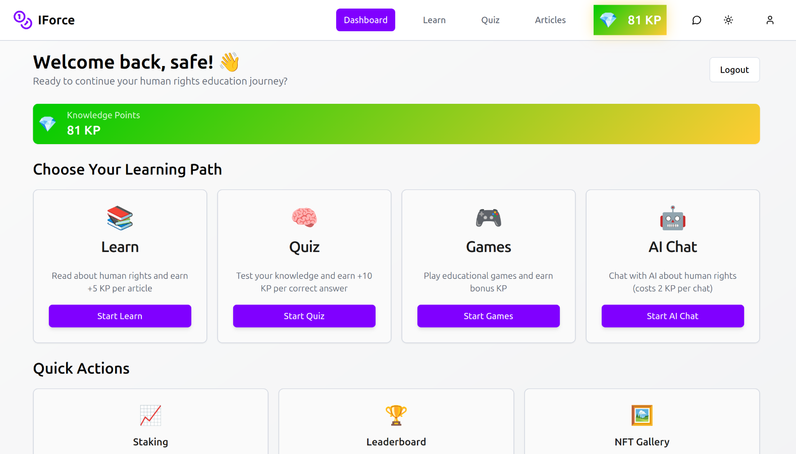

# `integralforce`

integral force - To be able to earn while learning on ICP

<div>
  
</div>


## fig 1 landing page image



## fig 2 dashboard page image

# Team Integral - integralforce | integral education | iforce

### Team Members:

- **Abdulrahman Abdulsalam**  
  Email: abdulsalamamtech@gmail.com

- **Muhammad Lawan**  
  Email: muhammedlawanrabiu@gmail.com

- **Prince Ajocha**  
  Email: princejosephpj56@gmail.com

- **Abdulsalam Mohammed**  
  Email: ammuftau74@gmail.com

---

## Project Overview

This project focuses on building an AI-powered personal tutor that promotes learning about crime and anti-corruption practices through interactive features. Our solution is designed to engage users with educational content, while also incorporating gamified elements for better retention and motivation.

### Key Features:

1. **Leaderboard/Grading System:**  
   We implemented a leaderboard or simple grading system that allows users to track their progress as they advance through different content and acquire more knowledge on anti-corruption and crime prevention strategies.
2. **Q&A Game:**  
   A simple question-and-answer game that engage users by presenting various behavioral tricks and tips for being a dutiful global citizen. This provide an interactive learning experience while reinforcing key lessons.
3. **Chat with AI**
   User can chat with AI and ask human right related questions.

---

### Upcomming Key Features:

1. **Full access to the AI model from the backend canister:**  
   We plan to fully implement HTTPS outcalls on the Internet Computer Protocol (ICP). This feature will allow canisters to directly communicate with external HTTP(S) servers.
2. **Dynamic content:**  
   All content both lessons and Q&A will be render dynamically from the canister using AI,
   this will allow the users to learn based on their experience and learning capability.

---

## Challenges

While adding these features to our existing repository, we faced several challenges. Due to technical difficulties, one is that we are not proficient in the svelte programming for the frontend as it keeps populating errors, we decided to write new code to integrate our intended features more efficiently.

---

## Contact Us

For more information or inquiries, feel free to contact the team members via email: abdulsalamamtech@gmail.com.

X (Twitter) >> https://x.com/integralforceic

Dorahacks >> https://dorahacks.io/buidl/28855

---

## Links

Deployed canisters.

URLs:

local : http://ucwa4-rx777-77774-qaada-cai.localhost:4943/

Upgraded code for canister integralforce_frontend, with canister ID ucwa4-rx777-77774-qaada-cai
Module hash 6674d62a34b3baf7909421b5a386afb09d9898d970e9b40178534ed30d1f8a4a is already installed.

Upgraded code for canister internet_identity, with canister ID ufxgi-4p777-77774-qaadq-cai
Deployed canisters.

URLs:
Frontend canister via browser:
integralforce_frontend: - http://ucwa4-rx777-77774-qaada-cai.localhost:4943/ (Recommended) - http://127.0.0.1:4943/?canisterId=ucwa4-rx777-77774-qaada-cai (Legacy)

    internet_identity:
      - http://ufxgi-4p777-77774-qaadq-cai.localhost:4943/ (Recommended)
      - http://127.0.0.1:4943/?canisterId=ufxgi-4p777-77774-qaadq-cai (Legacy)

Backend canister via Candid interface:
integralforce_backend: http://127.0.0.1:4943/?canisterId=vizcg-th777-77774-qaaea-cai&id=ulvla-h7777-77774-qaacq-cai
internet_identity: http://127.0.0.1:4943/?canisterId=vizcg-th777-77774-qaaea-cai&id=ufxgi-4p777-77774-qaadq-cai

---

# Project

Welcome to your new `integralforce` project and to the Internet Computer development community. By default, creating a new project adds this README and some template files to your project directory. You can edit these template files to customize your project and to include your own code to speed up the development cycle.

To get started, you might want to explore the project directory structure and the default configuration file. Working with this project in your development environment will not affect any production deployment or identity tokens.

To learn more before you start working with `integralforce`, see the following documentation available online:

- [Quick Start](https://internetcomputer.org/docs/current/developer-docs/setup/deploy-locally)
- [SDK Developer Tools](https://internetcomputer.org/docs/current/developer-docs/setup/install)
- [Motoko Programming Language Guide](https://internetcomputer.org/docs/current/motoko/main/motoko)
- [Motoko Language Quick Reference](https://internetcomputer.org/docs/current/motoko/main/language-manual)

If you want to start working on your project right away, you might want to try the following commands:

```bash
cd integralforce/
dfx help
dfx canister --help
```

## Running the project locally

If you want to test your project locally, you can use the following commands:

```bash
# Starts the replica, running in the background
dfx start --background

# Deploys your canisters to the replica and generates your candid interface
dfx deploy
```

Once the job completes, your application will be available at `http://localhost:4943?canisterId={asset_canister_id}`.

If you have made changes to your backend canister, you can generate a new candid interface with

```bash
npm run generate
```

at any time. This is recommended before starting the frontend development server, and will be run automatically any time you run `dfx deploy`.

If you are making frontend changes, you can start a development server with

```bash
npm start
```

Which will start a server at `http://localhost:8080`, proxying API requests to the replica at port 4943.

### Note on frontend environment variables

If you are hosting frontend code somewhere without using DFX, you may need to make one of the following adjustments to ensure your project does not fetch the root key in production:

- set`DFX_NETWORK` to `ic` if you are using Webpack
- use your own preferred method to replace `process.env.DFX_NETWORK` in the autogenerated declarations
  - Setting `canisters -> {asset_canister_id} -> declarations -> env_override to a string` in `dfx.json` will replace `process.env.DFX_NETWORK` with the string in the autogenerated declarations
- Write your own `createActor` constructor
